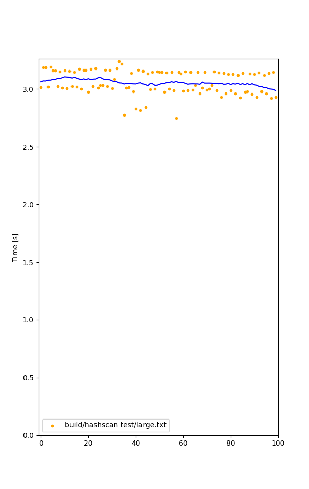

# hashscan

hashscan is a utility for identifying hashes and other strings within large files. Hashscan utilizes [Intel Hyperscan](https://github.com/intel/hyperscan) for high performance regex pattern matching.

- [hashscan](#hashscan)
  - [Hardware Requirements](#hardware-requirements)
  - [Dependencies](#dependencies)
  - [Building](#building)
  - [Usage](#usage)
  - [Performance Metrics](#performance-metrics)
  - [Testing](#testing)

## Hardware Requirements

- x86 32-bit or 64-bit CPU
  - Intel Streaming SIMD Extensions 3 (SSE3)
  - Intel Streaming SIMD Extensions 4.2 (SSE4.2) *optional*
  - POPCNT *optional*
  - Bit Manipulation Instructions BMI/BMI2 *optional*
  - Intel Advanced Vector Extensions 2 (AVX2) *optional*
  - Intel Advanced Vector Extensions 512 (AVX-512) *optional*

Hyperscan can make use of SSE4.2, POPCNT, BMI/BMI2, and AVX2 if present; these are determined at library compile time.

There might possibly be plans to support ARM by utilizing [Vectorscan](https://github.com/VectorCamp/vectorscan) for ARM builds.

## Dependencies

- [Intel Hyperscan](https://github.com/intel/hyperscan)
  - CMake >= 2.8.11
  - Ragel 6.9
  - Python 2.7
  - Boost >= 1.57

## Building

Building hashscan first requires building hyperscan. Hyperscan is added as a git submodule within this repo. Follow the Hyperscan [build instructions](https://intel.github.io/hyperscan/dev-reference/getting_started.html)

```sh
mkdir -p lib/hyperscan                            # the directory to build hyperscan
cd lib/hyperscan 
cmake [-G <generator>] [options] ../../hyperscan  # Use build system of your liking, by default is make.
make -j<jobs>                                     # Build hyperscan, in this line using make in parallel as the generator. Use the generator you chose
./bin/unit-hyperscan                              # Run hyperscan unit tests
```

Compiling Hyperscan depends on a recent version of the Boost C++ header library. If the Boost libraries are installed on the build machine in the usual paths, CMake will find them. If the Boost libraries are not installed, the location of the Boost source tree can be specified during the CMake configuration step using the BOOST_ROOT variable (described below).

Another alternative is to put a copy of (or a symlink to) the boost subdirectory in `hyperscan/include/boost.`

For example: for the Boost-1.59.0 release:

```sh
ln -s boost_1_59_0/boost hyperscan/include/boost
```

Refer to the hyperscan instruction for more detailed information regarding building hyperscan to your liking.

Once hyperscan is build, you can build hashscan by

```sh
cd <repo root>
make
```

## Usage

You can use hashscan from the command line by

```sh
hashscan <file to scan>
```
## Performance Metrics

The following figures were measured using [Hyperfine](https://github.com/sharkdp/hyperfine) on a Intel i9-13900H @ 5.400 GHz. The file provided is a dataset of 75000 lines for a total of 2.9Mb in size.

```
Time (mean ± σ):      3.061 s ±  0.103 s    [User: 3.040 s, System: 0.021 s]
  Range (min … max):    2.750 s …  3.239 s    100 runs

  runs:        100
  mean:      3.061 s
  stddev:    0.103 s
  median:    3.033 s
  min:       2.750 s
  max:       3.239 s

  percentiles:
     P_05 .. P_95:    2.919 s .. 3.178 s
     P_25 .. P_75:    2.989 s .. 3.149 s  (IQR = 0.160 s)
```




## Testing

You can run tests for the supported patterns by running the python scripts in the `test` folder. These will generate a textfile that can be passed to hashscan. For example, to test SHA256

```sh 
python3 test/sha256/generate_sha256.py >> test/sha256/sha256_.txt 
hashscan test/sha256/sha256_test.txt
```

